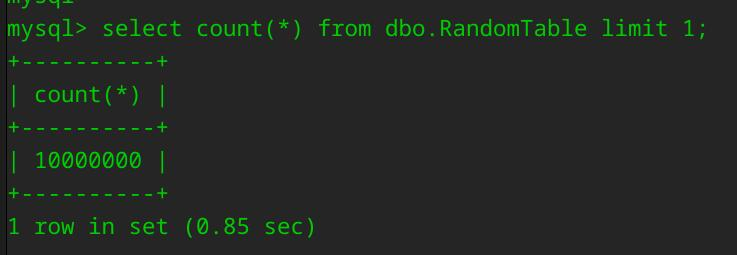
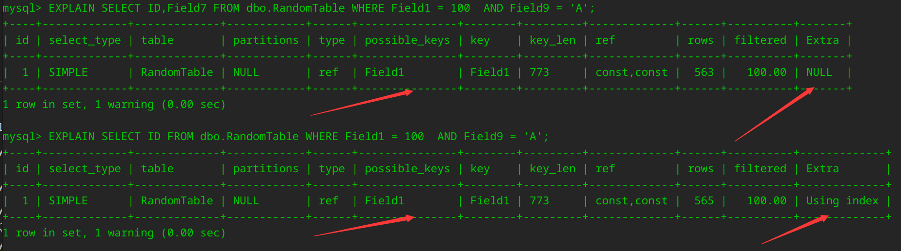

## 本文前提

- 针对最近工作遇到的问题, 简单写个测试并记录一下
- 对生产实践没有指导意义, 仅可作为参考观察下数量级的差异

## 什么是回表查询？

谈到回表查询，就不得不提到"索引覆盖"的概念。

索引覆盖指的是，通过索引就能获取到所需要的所有数据，无需通过回表查询，避免了对主表数据的二次查询，从而提高查询效率。

## 回表查询会慢多少？

首先我们生成一个随机表
```sql
// generated by CodeGeex
CREATE TABLE dbo.RandomTable (
    ID BIGINT  DEFAULT 0,
    Field1 INT  DEFAULT 0,
    Field2 NVARCHAR(255)  DEFAULT '',
    Field3 DECIMAL(10, 2)  DEFAULT 0,
    Field4 DATE  DEFAULT '1900-01-01',
    Field5 TIME  DEFAULT '00:00:00',
    Field6 DATETIME  DEFAULT '1900-01-01 00:00:00',
    Field7 SMALLINT  DEFAULT 0,
    Field8 INT  DEFAULT 0,
    Field9 NVARCHAR(255)  DEFAULT '',
    Field10 INT  DEFAULT 0,
    PRIMARY KEY (ID),
    INDEX (Field1, Field9)
);
```
然后我们插入一些数据
```sql
# -*- coding: utf-8 -*-

import random
import pymysql

# 连接到MySQL数据库
connection = pymysql.connect(host='localhost',
                            user='root',
                            password='your_password',
                            charset='utf8mb4',
                            cursorclass=pymysql.cursors.DictCursor)

# 创建一个游标对象
cursor = connection.cursor()

# 插入数据
for i in range(10000000):
  id = i
  field1 = random.randint(1, 100)
  field2 = random.choice(['A', 'B', 'C', 'D', 'E', 'F']) * random.randint(1, 20)
  field3 = round(random.uniform(1, 100), 2)
  field4 = random.choice(['1900-01-01', '2022-01-01', '2021-01-01', '2020-01-01'])
  field5 = random.choice(['00:00:00', '12:00:00', '18:00:00'])
  field6 = random.choice(['1900-01-01 00:00:00', '2022-01-01 00:00:00', '2021-01-01 00:00:00', '2020-01-01 00:00:00'])
  field7 = random.randint(1, 100)
  field8 = random.randint(1, 100)
  field9 = random.choice(['A', 'B', 'C', 'D', 'E', 'F']) * random.randint(1, 20)
  field10 = random.randint(1, 100)

  sql = f"INSERT INTO dbo.RandomTable (ID, Field1, Field2, Field3, Field4, Field5, Field6, Field7, Field8, Field9, Field10) VALUES ({id}, {field1}, '{field2}', {field3}, '{field4}', '{field5}', '{field6}', {field7}, {field8}, '{field9}', {field10});"
  cursor.execute(sql)

# 提交事务
connection.commit()

# 关闭游标和连接
cursor.close()
connection.close()
```

插入成功！


接下来我们设计一下对比实验, 验证回表和补回表对查询速度的影响, 为了减少传输数据对结果的影响，我们只在对照组多select一个SMALLINT的Field7
    
    对照组：根据 Field1, Field9 -> select ID 和 Field7

    实验组：根据 Field1, Field9 -> select ID

我们explain一下看一下方案是否OK



由图所示，他们使用了同一个索引, 不同的个是对照组有一个Using Index, 即索引覆盖，方案验证ok，开搞！

```sql
# 对照组脚本

# -*- coding: utf-8 -*-

import time
import random
import pymysql

# 连接到MySQL数据库
connection = pymysql.connect(host='localhost',
                        user='root',
                        password='your_password',
                        charset='utf8mb4',
                        cursorclass=pymysql.cursors.DictCursor)

# 创建一个游标对象
cursor = connection.cursor()

# 初始化变量
start_time = time.time()

# 循环1万次
for i in range(10000):
    # 获取表中的数据
    cursor.execute("SELECT ID, Field7 FROM dbo.RandomTable WHERE Field1 = %s AND Field9 = %s", (random.randint(1, 100), random.choice(['A', 'B', 'C', 'D', 'E', 'F']) * random.randint(1, 20)))

# 计算耗时
end_time = time.time()
print("用时：", end_time - start_time)

# 关闭游标和连接
cursor.close()
connection.close()
```

```sql
# 实验组脚本

# -*- coding: utf-8 -*-

import time
import random
import pymysql

# 连接到MySQL数据库
connection = pymysql.connect(host='localhost',
                        user='root',
                        password='your_password',
                        charset='utf8mb4',
                        cursorclass=pymysql.cursors.DictCursor)

# 创建一个游标对象
cursor = connection.cursor()

# 初始化变量
start_time = time.time()

# 循环1万次
for i in range(10000):
    # 获取表中的数据
    cursor.execute("SELECT ID FROM dbo.RandomTable WHERE Field1 = %s AND Field9 = %s", (random.randint(1, 100), random.choice(['A', 'B', 'C', 'D', 'E', 'F']) * random.randint(1, 20)))

# 计算耗时
end_time = time.time()
print("用时：", end_time - start_time)

# 关闭游标和连接
cursor.close()
connection.close()
```

结果如下:

|       |   耗时              |
| :---  |  :----:             |
| 对照组 | 106.707843542099   |
| 实验组 | 28.748051643371582 |

几乎是4倍的性能提升！！

由此，我们可以粗略的得出结论，不回表可以有倍数级别的性能提升。当然本实验一些不足，比如在生产实践中，使用索引覆盖查询一般需要把一些字段加到索引中，这会显著增加索引的大小，也会拖累查询速度，在不需要该字段的查询中甚至是有负收益的，但是我们仍然应该推荐使用索引覆盖这项技术。
