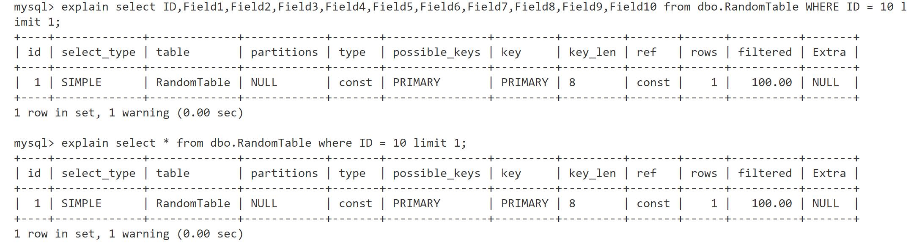

首先我们像上一节一样生成表并插入数据

然后设计一个简单的对比实验
    
    对照组：根据 ID -> select *

    实验组：根据 ID select ID，Field1,...,Field10

我们explain一下



```python
# 对照组脚本
# 执行100000次

cursor.execute("SELECT * FROM dbo.RandomTable WHERE ID = %s", (random.randint(1, 10000000)))
```

```python
# 实验组脚本
# 执行100000次

cursor.execute("SELECT ID,Field1,Field2,Field3,Field4,Field5,Field6,Field7,Field8,Field9,Field10 FROM dbo.RandomTable WHERE ID = %s", (random.randint(1, 10000000)))
```

结果如下:

|       |   执行10万次耗时     |
| :---  |       :----:       |
| 对照组 | 27.537091970443726 |
| 实验组 | 27.903645753860474 |

通过多次尝试，可以发现select * 会稍微快一点点，差距在1%左右，可能是因为传输数据更少导致的，考虑到我是在本机进行实验，在网络环境中可能会放大这个问题。


