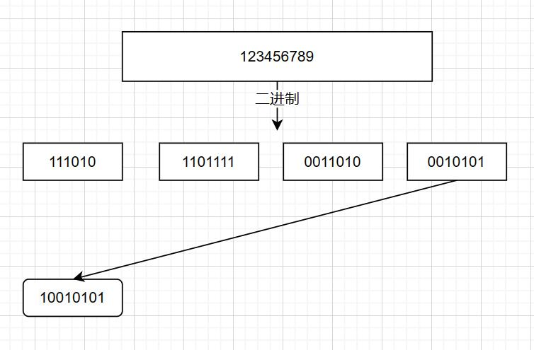
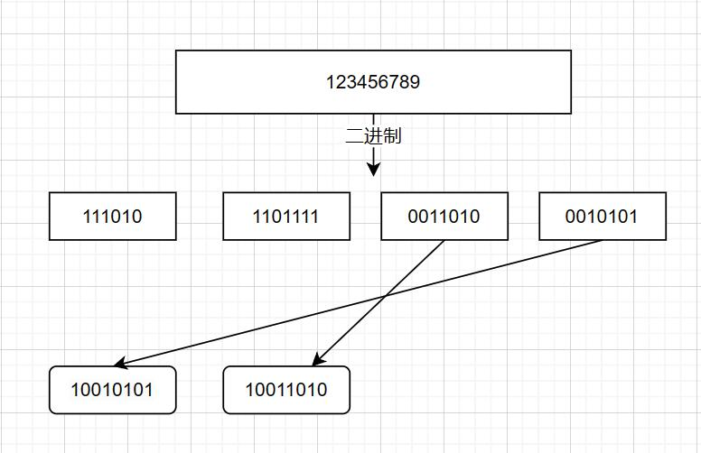
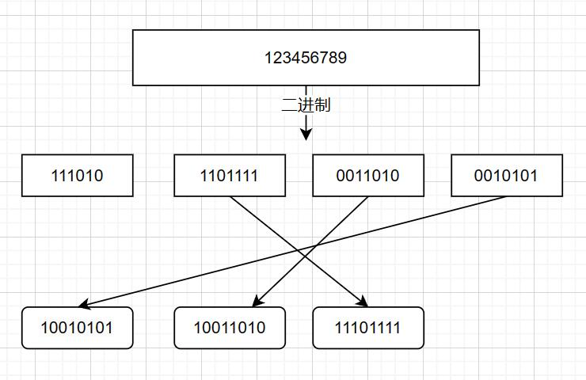
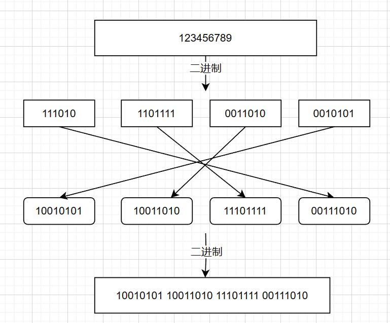

[Pb字段的编解码](#Pb字段的编解码)

[Message的编解码](#Message的编解码)

## Pb字段的编解码

这一块我们可以粗略分成三种来讨论

- 无符号数字: 没有标志位
- 有符号数字: 首位是标志位, 表示是否是负数
- 二进制(字符串等): 没有明显特点，为了二进制安全，需要知道长度

**无符号整数**

对于无符号数字，protobuf使用Varint(变长数字)来存储。实现原理是每个byte的第一位来存储是否结束, 0表示已经结束，1表示未结束，后面7位存储实际数字。

我们来先看代码
```C++
template <typename T>
PROTOBUF_ALWAYS_INLINE static uint8_t* UnsafeVarint(T value, uint8_t* ptr) {
    // varint只对无符号整数有效
    static_assert(std::is_unsigned<T>::value,
                    "Varint serialization must be unsigned");
    // 0x80 = 2^7, 7个bit最大存储 0b0111,1111, 即0x80 - 1
    while (PROTOBUF_PREDICT_FALSE(value >= 0x80)) {
        // ptr指向的byte为0b1000,0000 | value, 即第一位是1, 后七位是value的后七位
        *ptr = static_cast<uint8_t>(value | 0x80);
        // 偏移指针, 继续存储
        value >>= 7;
        ++ptr;
    }

    // value剩余的数小于0x80, 存储到后面，这个byte的第一位是0，后7位存储实际数字
    *ptr++ = static_cast<uint8_t>(value);
    return ptr;
}
```
我们以123456789为例, 我们可以看做从右向左扫描二进制数字, 然后从左到右生成decoded buffer
 $\dashrightarrow$  $\dashrightarrow$  $\dashrightarrow$ 

从实际使用来说，较小的数字出现频率还是比较高的, 那么 $\leqslant$ 127 的数字只用一个byte就可以存储了, UINT32_MAX的话也最多只需要加一个byte，用5个byte来存储, 所以我们可以说“大概率使用Varint可以减小存储长度，便于网络传输”。

**有符号整数**

相于无符号数字，有符号数字的第一位用来表示正负，此时我们使用Varint的话，就总是会小号更多的byte, 于是protobuf把有符号数字的"其它的bit左移一位，第一个bit放到最后一位", 然后在使用Varint，这种方式称之为Zigzag。

```C++
inline uint64_t WireFormatLite::ZigZagEncode64(int64_t n) {
  // Note:  the right-shift must be arithmetic
  // Note:  left shift must be unsigned because of overflow
  return (static_cast<uint64_t>(n) << 1) ^ static_cast<uint64_t>(n >> 63);
}
```

## Message的编解码

这里我们从代码切入，逐步剖析

```C++
template <MessageLite::ParseFlags flags, typename T>
bool MessageLite::ParseFrom(const T& input) {
  // 先清空数据, 避免和现在的数据相互影响
  // 所有字段设置为默认值,, pb 文件里的clear_value()函数
  if (flags & kParse) Clear();
  constexpr bool alias = (flags & kMergeWithAliasing) != 0;
  return internal::MergeFromImpl<alias>(input, this, flags);
}
```
经过一系列调用，到达下面的函数
```C++
PROTOBUF_NOINLINE const char* TcParser::ParseLoop(
    MessageLite* msg,  // Message指针, 数据解析后的output
    const char* ptr,   // 原数据指针, 数据的input
    ParseContext* ctx, // 数据解析过程记录器
    const TcParseTableBase* table // 解析表, 存在reflection里, 语法字典, pb自动生成的, 在pb.cc文件里
    ) {
  // Note: TagDispatch uses a dispatch table at "&table->fast_entries".
  // For fast dispatch, we'd like to have a pointer to that, but if we use
  // that expression, there's no easy way to get back to "table", which we also
  // need during dispatch.  It turns out that "table + 1" points exactly to
  // fast_entries, so we just increment table by 1 here, to get the register
  // holding the value we want.
  table += 1;
  while (!ctx->Done(&ptr)) {
#if defined(__GNUC__)
    // Note: this asm prevents the compiler (clang, specifically) from
    // believing (thanks to CSE) that it needs to dedicate a registeer both
    // to "table" and "&table->fast_entries".
    // TODO(b/64614992): remove this asm
    asm("" : "+r"(table));
#endif
    ptr = TagDispatch(msg, ptr, ctx, TcFieldData::DefaultInit(), table - 1, 0);
    if (ptr == nullptr) break;
    if (ctx->LastTag() != 1) break;  // Ended on terminating tag
  }
  return ptr;
}
```
接下来我们进入TagDispatch, 查看每一个字段的解析过程
```C++
// Dispatch to the designated parse function
inline PROTOBUF_ALWAYS_INLINE const char* TcParser::TagDispatch(
    PROTOBUF_TC_PARAM_NO_DATA_DECL) {
  // 读取两个byte
  const auto coded_tag = UnalignedLoad<uint16_t>(ptr);
  // fast_idx_mask是这么生成的
  // (((1 << tc_table_info_->table_size_log2) - 1) << 3))
  // 可以在pb.cc里面找到
  const size_t idx = coded_tag & table->fast_idx_mask;
  // 生成的时候是 <<3, 后三位肯定是0
  PROTOBUF_ASSUME((idx & 7) == 0);

  // idx右移三位对应aux_field_number, 找到一个FastFieldEntry用于解析
  // 可能是避免生成太多的entry?
  auto* fast_entry = table->fast_entry(idx >> 3);
  TcFieldData data = fast_entry->bits;
  data.data ^= coded_tag;

  // 使用指定的target()函数来解析, target()是包装Varint和Zigzag解析函数
  PROTOBUF_MUSTTAIL return fast_entry->target()(PROTOBUF_TC_PARAM_PASS);
}
```
target 函数大概如下, 这里面没有看懂，之后再看看
```C++
PROTOBUF_NOINLINE const char* TcParser::FastV32S1(PROTOBUF_TC_PARAM_DECL) {
  PROTOBUF_MUSTTAIL return FastVarintS1<uint32_t>(PROTOBUF_TC_PARAM_PASS);
}

template <typename FieldType>
PROTOBUF_ALWAYS_INLINE const char* TcParser::FastVarintS1(
    PROTOBUF_TC_PARAM_DECL) {
  using TagType = uint8_t;
  if (PROTOBUF_PREDICT_FALSE(data.coded_tag<TagType>() != 0)) {
    PROTOBUF_MUSTTAIL return MiniParse(PROTOBUF_TC_PARAM_NO_DATA_PASS);
  }
  int64_t res;
  ptr = ShiftMixParseVarint<FieldType>(ptr + sizeof(TagType), res);
  if (PROTOBUF_PREDICT_FALSE(ptr == nullptr)) {
    PROTOBUF_MUSTTAIL return Error(PROTOBUF_TC_PARAM_NO_DATA_PASS);
  }
  hasbits |= (uint64_t{1} << data.hasbit_idx());
  RefAt<FieldType>(msg, data.offset()) = res;
  PROTOBUF_MUSTTAIL return ToTagDispatch(PROTOBUF_TC_PARAM_NO_DATA_PASS);
}
```

从网上找了些资源，大概都只是说, 代码还是得自己看
```
key = (field_number << 3) | wire_type
```

一个很好的资源推荐 [链接](https://www.cnblogs.com/shine-lee/p/10701810.html)
